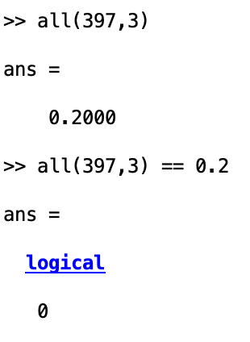

```{r include=FALSE}
library(tidyverse)
library(janitor)
library(here)
library(magick)
library(gridExtra)
theme_set(theme_bw())
helpers_path = paste0(here(),'/analysis/helpers/')
source(paste0(helpers_path, '01_clean_behavioral_data.R'))
fig_out_path = paste0(here(), '/outputs/fig/')
```

# Helper functions

```{r}
convertFVToHEX = function(fillingVal){
  
  if (is.na(fillingVal)){
    hex_code = NA
  } else {
    bothCol = matrix(data = c(.1 , .1, .4, -99, .4, .1, .1, -99), byrow=T, nrow=2, ncol=4)
  
  if(fillingVal>=0){
    colorStim = bothCol[1,]
    colorStim[3] = ifelse(abs(fillingVal)==.4, .6, ifelse(abs(fillingVal)==.6,.5, ifelse(abs(fillingVal)==.85, .3, colorStim[3])))
    
  } else{
    colorStim = bothCol[2,]
    colorStim[1] = ifelse(abs(fillingVal)==.4, .6, ifelse(abs(fillingVal)==.6,.5, ifelse(abs(fillingVal)==.85, .3, colorStim[1])))
  }
  
  colorStim[4] = abs(fillingVal)
  
  hex_code = rgb(colorStim[1], colorStim[2], colorStim[3], colorStim[4])
  }
  
  return(hex_code)
}

make_stim_img = function(shape, orientation, filling){
  
  blank = image_blank(width = 800, height = 800, color = "none")
  
  # Needs to be run in terminal or all at one in the chunk
  img = image_draw(blank)
  
  bg_hex = convertFVToHEX(filling)
  
  symbols(400, 400, circles = 200, bg = bg_hex, inches = FALSE, add = TRUE, lwd = 6)
  
  bg_circle = image_read(image_write(img))
  
  
  shape_img = image_read(paste0('/Users/zeynepenkavi/Downloads/alldata/data_task/pilot5_fmri_1/task_scan/shapes/shape', shape, '.png'))
  
  tilted_nofill_img = shape_img %>% 
    image_background("none") %>%
    image_scale("200") %>%
    image_rotate(orientation)
  
  tilted_nofill_img = image_read(image_write(tilted_nofill_img))
  
  offset_x = 200 + (200 - (image_info(tilted_nofill_img)$width/2))
  offset_y = 200 + (200 - (image_info(tilted_nofill_img)$height/2))
  inset_offset = paste0('+', offset_x, '+', offset_y)
  stim_img = image_composite(bg_circle,  tilted_nofill_img, operator = "Over", offset = inset_offset)
  
  return(stim_img)
  
}

img_read_border_annotate = function(img_fn, annot_img=TRUE){
  img = image_read(img_fn)
  
  if(grepl('ht', img_fn)){
    img = image_border(img,"black","1x1")
    
    # Remove HT from image file name for annotation
    img_fn = paste0(strsplit(img_fn, "_")[[1]][1], '.png')
  }
  
  if(annot_img){
    
    cur_sub = as.numeric(strsplit(strsplit(img_fn, "/")[[1]][11], "-")[[1]][2])
    cur_stimNum = as.numeric(strsplit(strsplit(img_fn, "/")[[1]][12], '\\.')[[1]][1])
    
    cur_stimDat = data_yn_clean %>%
      filter((subnum == cur_sub) & (stimNum == cur_stimNum)) %>%
      select(orientation, filling, shape, valueO, valueF, valueS) %>%
      distinct() %>%
      mutate(meanPayoff = round(100 * ((valueS + valueO + valueF)/2) ))
      
    cur_shape = cur_stimDat$shape
    cur_orient = cur_stimDat$orientation
    cur_filling = cur_stimDat$filling
    cur_val = cur_stimDat$meanPayoff
    
    annot = paste0("s: ", cur_shape, ", o: ", cur_orient, ", f: ", cur_filling, " \nvalue: ", cur_val)
  
    img = image_annotate(img, annot, size=80, gravity = "north")
  }
  
  
  return(grid::rasterGrob(img))
}
```

Save some images of sample stimuli

```{r}
tmp = make_stim_img(shape = 3, orientation = 0, filling = -0.6)

image_write(tmp, path = paste0(fig_out_path, 'sample_stim1.png'), format = 'png')

tmp = make_stim_img(shape = 2, orientation = 120, filling = 0.4)

image_write(tmp, path = paste0(fig_out_path, 'sample_stim2.png'), format = 'png')
```

# Filling values

Matlab code from `task_YN.m` that determines the filling value for each stimulus

```
bothCol = [0.1 0.1 0.4 -99;
            0.4 0.1 0.1 -99]; 

if  mydata.filling(indextrial)>=0
    colorStim = bothCol(1,:);
    switch  abs(mydata.filling(indextrial))
        case 0.4
            colorStim(3)= 0.6;
        case 0.6
            colorStim(3)= 0.5;
        case 0.85
            colorStim(3)= 0.3;
    end   
else
    colorStim = bothCol(2,:);
    switch  abs(mydata.filling(indextrial))
        case 0.4
            colorStim(1)= 0.6;
        case 0.6
            colorStim(1)= 0.5;
        case 0.85
            colorStim(1)= 0.3;
    end
end
colorStim(4)=abs(mydata.filling(indextrial));
```

What are the HEX codes for the filling values in the data?

```{r}
dat = data.frame(filling = unique(data_yn_clean$filling))

for(i in 1:nrow(dat)){
  dat$hex_code[i] = convertFVToHEX(dat$filling[i])
}

dat = dat %>%
  arrange(filling)

dat
```

View the filling colors for the stimuli

```{r}
ggplot()+
  annotate("rect", xmin=c(1,2,3,1,2,3,1,2,3), xmax=c(2,3,4,2,3,4,2,3,4), ymin=c(1,1,1,2,2,2,3,3,3) , ymax=c(2,2,2,3,3,3,4,4,4), fill=c(dat$hex_code))+
  annotate("text", x=c(1,2,3,1,2,3,1,2,3)+.5, y=c(1,1,1,2,2,2,3,3,3)+.5 , label=c(dat$filling))+
  theme(axis.ticks = element_blank(),
        axis.text = element_blank(),
        panel.grid = element_blank(),
        axis.title = element_blank(),
        panel.border = element_blank())
```

BUT THIS WOULD MEAN THERE ARE ONLY 9 INSTEAD OF 11 VALUES WHICH WOULD REPEAT FILLING VALUES!  
So there would be two same stimuli with different payoffs.

In `createStimuli.m` there is also this conversion of the third column of `all` which contains the filling levels.

It converts the filling levels that are assigned to filling values to different levels. Instead of the levels above there are two other levels in this set of numbers.

```
all(all(:,3)==0.2,3)= 0.05;
all(all(:,3)==0.4,3)= 0.17;
all(all(:,3)==0.6,3)= 0.4;
all(all(:,3)==0.8,3)= 0.6;
all(all(:,3)==1,3)= 0.85;
all(all(:,3)==-0.2,3)= -0.05;
all(all(:,3)==-0.4,3)= -0.17;
all(all(:,3)==-0.6,3)= -0.4;
all(all(:,3)==-0.8,3)= -0.6;
all(all(:,3)==-1,3)= -0.85;
```

What do these look like

```{r}
dat = data.frame(filling = c(.05, .17, .4, .6, .85, 0, -.05, -.17, -.4, -.6, -.85, NA))

for(i in 1:nrow(dat)){
  dat$hex_code[i] = convertFVToHEX(dat$filling[i])
}

dat = dat %>%
  arrange(filling)

dat
```

```{r}
ggplot()+
  annotate("rect", xmin=c(1,2,3,4,1,2,3,4,1,2,3,4), xmax=c(2,3,4,5,2,3,4,5,2,3,4,5), ymin=c(1,1,1,1,2,2,2,2,3,3,3,3) , ymax=c(2,2,2,2,3,3,3,3,4,4,4,4), fill=c(dat$hex_code))+
  annotate("text", x=c(1,2,3,4,1,2,3,4,1,2,3,4)+.5, y=c(1,1,1,1,2,2,2,2,3,3,3,3)+.5 , label=c(dat$filling))+
  theme(axis.ticks = element_blank(),
        axis.text = element_blank(),
        panel.grid = element_blank(),
        axis.title = element_blank(),
        panel.border = element_blank())
```

**why are they different than the ones in the behavioral data filling column**

`data_choiceYN.csv` is a merge of all `taskYN_subj*_day*_session4.mat` created by `createDataYN.m`. Each of these `.mat` files involve a struct called `mydata`. The `filling` attribute in these structs has the 9 (not 11!) values in we have in the `data_choiceYN.csv`.

Where are these assigned in the `mydata` struct?

`mydata` is both the input and the output of the `taskYN.m` function.

In `taskYN.m` when `showStimulusOnScreen` is called the input specifying filling is not from `mydata` but from `colorStim` which is the converted value of `mydata.filling`.

The `mydata.filling` values are specified in `createStimuli.m` so the lines above converting `all(:3)` should have changed these. 

**BUT due to rounding error this didn't work as intended! So in the stimuli there were indeed 9 filling values instead of 11** )

# Stim outcomes

The stimuli are not gambles. If they are chosen to be played they always yield the same reward. If they are not chosen then they yield the reference amount.

```{r}
tmp = data_yn_clean %>%
  filter(yesChosen == 1) %>%
  select(possiblePayoff, payoff)

sum(tmp$possiblePayoff == tmp$payoff) == nrow(tmp)
```

*BUT* the payoff for each stimulus is sampled from a distribution

```{r}
data_yn_clean %>%
  filter(subnum == "601") %>%
  filter(stimNum == 85) %>%
  tabyl(possiblePayoff)
```

# Number of stims/session

How many HT and RE trials in each session?

```{r}
with(data_yn_clean, table(type, day, subnum))
```

How many HT and RE trials in each imaging session?

```{r}
with(data_bc_clean, table(typeLeft, day, fmri, subnum))
```

# Attribute values

3 features: 
Shape 6
Orientation 11
Filling 11

Does the orientation and filling have the same value for each shape? Yes.

```{r}
dat = data_yn_clean %>%
  filter(subnum == 601) %>%
  select(subnum, day, stimNum, type, orientation, filling, shape, valueO, valueF, valueS, possiblePayoff)
```

```{r}
with(dat, table(orientation, valueO, shape))
```

```{r}
with(dat, table(filling, valueF, shape))
```

How are the payoffs for each stimulus computed? From matlab code:

```
% all(:,4) <- shape value
% all(:,5) <- orientation value
% all(:,6) <- filling color value

round(((all(:,4) + all(:,5) + all(:,6))/2)*100)
```

```{r}
dat %>%
  select(orientation, filling, shape, valueO, valueF, valueS, possiblePayoff) %>%
  mutate(guess = round(100 * ((valueS + valueO + valueF)/2) ))
```


# Save stims for all subjects

Makes and save all stim images for all subjects

```{r eval=FALSE}

# 726*6 = 4356 rows

stim_info = data_yn_clean %>%
  select(subnum, stimNum, orientation, filling, shape, type) %>%
  group_by(subnum, stimNum) %>%
  distinct()

# for(i in 1:10){ #test before running it for all stims
for(i in 1:nrow(stim_info)){
  cur_sub = stim_info$subnum[i]
  cur_type = stim_info$type[i]
  cur_stimNum = stim_info$stimNum[i]
  
  cur_shape = stim_info$shape[i]
  cur_orient = stim_info$orientation[i]
  cur_filling = stim_info$filling[i]
  
  if(cur_type == 1 | cur_type == "HT"){
    cur_stimNum = paste0(cur_stimNum, '_ht')
  }
  
  img_fn = paste0(fig_out_path, 'stims/sub-', cur_sub, '/', cur_stimNum, '.png')
  
  if(!file.exists(img_fn)){
    tmp = make_stim_img(shape = cur_shape, orientation = cur_orient, filling = cur_filling)
  
    image_write(tmp, path = img_fn, format = 'png')
    
    dev.off()
  }
  
}


```

# Stim and payoff report for each subject


```{r}
cur_sub = 601

img_path = paste0(fig_out_path, 'stims/sub-', cur_sub, '/')

img_fns = list.files(img_path)
img_fns = gtools::mixedsort(img_fns)

img_fns = img_fns[1:20]

rl = lapply(paste0(img_path, img_fns), img_read_border_annotate)

ml <- marrangeGrob(rl, nrow=11, ncol=11)

# ml

ggsave(paste0(fig_out_path, "tmp.pdf"), ml)
# ggsave(paste0(fig_out_path, "sub-",cur_sub, "_stims.pdf"), ml)
```

Order stims by 
shape in pages
filling in columns
orientation in rows

```{r}
cur_sub = 601

img_path = paste0(fig_out_path, 'stims/sub-', cur_sub, '/')

shape_vals = sort(unique(data_yn_clean$shape))
orient_vals = sort(unique(data_yn_clean$orient))

blank <- grid::rectGrob(gp=grid::gpar(fill="white"))
repList = list("-0.85" = 1, "-0.6" = 2, "-0.4" = 4, "-0.2" = 5, "0" = 6, "0.2" = 7, "0.4" = 9, "0.6" = 10, "0.85" = 11)
  
  
sl = list()
pl = list()

for(i in 1:length(shape_vals)){
  cur_shape = shape_vals[i]
  
  for(j in 1:length(orient_vals)){
    cur_orient = orient_vals[j]
    
    stimsOrder = data_yn_clean %>%
      filter((subnum == cur_sub) & (shape == cur_shape) & (orientation == cur_orient)) %>%
      select(subnum, stimNum, orientation, filling, shape, type, valueO, valueF, valueS) %>%
      distinct() %>%
      arrange(filling) %>%
      mutate(stimNum = ifelse(type == 1, paste0(stimNum, "_ht.png"), paste0(stimNum, ".png")))
    
    fillTable = table(stimsOrder$filling)
    
    stimsOrder = stimsOrder$stimNum
    
    rl = lapply(paste0(img_path, stimsOrder), img_read_border_annotate)
    
    if (length(rl) != 11){
      if(length(names(fillTable)) == 8){
        repSlot = repList[!names(repList) %in% names(fillTable)][[1]]
      } else{
        repSlot = repList[names(which(fillTable != c(1,1,2,1,1,1,2,1,1)))][[1]]
      }
      rl = append(rl, list(blank), repSlot)
    }
    
    sl[[j]] = arrangeGrob(grobs = rl, nrow=11, ncol=1)
  }
  
  pl[[i]] = arrangeGrob(grobs = sl, nrow = 1, ncol = 11)
}

ml <- marrangeGrob(grobs = pl, nrow=1, ncol=1)

ggsave(paste0(fig_out_path, "tmp4.pdf"), ml)
# ggsave(paste0(fig_out_path, "sub-",cur_sub, "_stims.pdf"), ml)
```

Because one filling value has two values there are two stimuli with different mean values 

```{r}
data_yn_clean %>%
  filter(subnum == cur_sub) %>%
  select(subnum, stimNum, orientation, filling, shape, type, valueO, valueF, valueS) %>%
  distinct() %>%
  arrange(shape, filling, orientation) %>%
  filter((shape == 1) & (orientation == 15) & (filling == .4))
```

# Annotate plot with stim images

```{r}

```

When the value different is large RE and HT Rts don't look very different.
Is this because of generalizing a particularly eggregious attribute value?

What does a high value difference RE and HT stimuli look like? What attribute drives their value to the extreme?

Are the RE trials particularly slow for low value difference because ...

When deciding for an HT stim is it more habit-like? Less conscious? More a quick memory retrieval?

hipp-value correlation?
